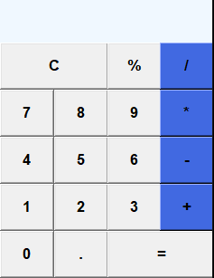

# **Calculator with Graphical Interface in Python**



Welcome to the Python GUI Calculator repository! This project is a simple implementation of a calculator developed in Python, with a friendly graphical interface.

- Resources
    - Intuitive Graphical Interface: Enjoy a pleasant user experience with an intuitive graphical interface, making mathematical operations simple and accessible.


How to use
Clone the Repository:
```
git clone https://github.com/HenriqueDavid-M/tk-Calculator-graphic-interface
cd tk-Calculator-graphic-interface
```

Run the Application:
```
python calculator.py
```


Have Fun Calculating: Use the graphical interface to perform your mathematical operations efficiently.

Contributions
Contributions are welcome! Feel free to open issues or submit pull requests to improve this project.

We hope you find this calculator useful for your daily math needs. Have fun calculating!